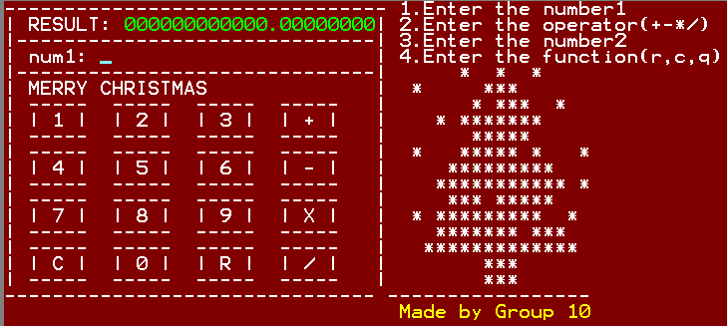

# Calculator-EMU8086-

### 수강과목 : 마이크로프로세서(2학년 2학기)

### 프로젝트 개요 :  
**EMU8086(MICROPROCESSOR EMULATOR)** 의 example 계산기 프로그램을 참고하여 사칙연산 계산기 설계 및 구현.

### 기간 : 2012.09 ~ 2012.12

### 역할 : 총 3명 중 팀장 역할, 프로젝트 전체 설계 및 곱셈, 나눗셈 구현

### 주요 기능 :
- EMU8086 example 계산기의 연산결과 최대 범위가 **2 WORD(32 bit)** 의 정수를 넘어 자릿수 제한이 없는 실수형 사칙연산 계산기
- **Interrupt** 를 이용하여 입력, 출력 기능 구현
- **자리올림(carry)** 과 **손계산** 알고리즘을 이용하여 사칙연산 구현
- **곱셈** 은 덧셈의 반복으로 알고리즘 구현
- **나누기** 는 몇번을 뺄 수 있는지에 대한 알고리즘 구현
- **음수, 양수** 에 대한 판별 알고리즘 구현
- 연산된 결과값을 저장하여 결과값에 **재계산** 기능 구현
- 연산된 결과값을 **초기화** 할 수 있는 기능을 구현하여 프로그램을 재시작해야 하는 불편함을 없앰

#### **사용 기술** : `assembly`

#### **사용 툴** : `EMU8086`

### SCREEN SHOT
-------

